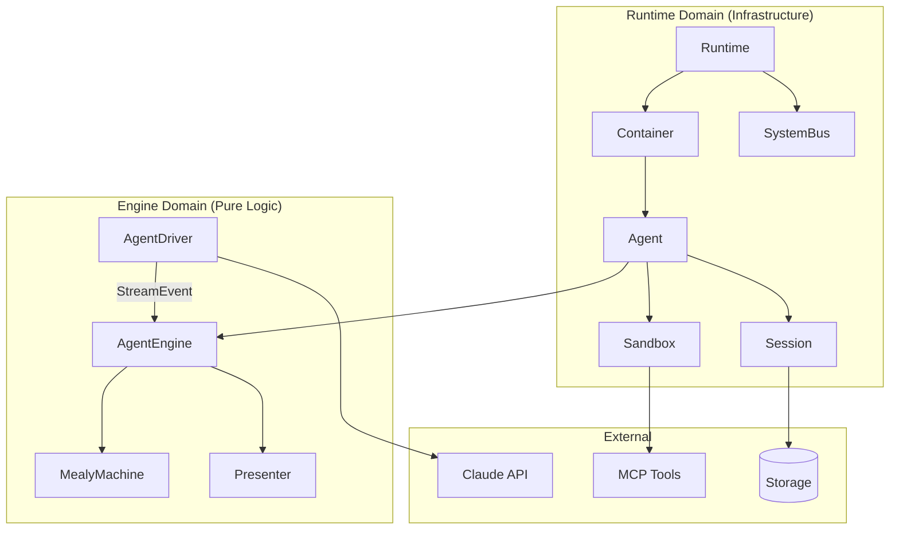
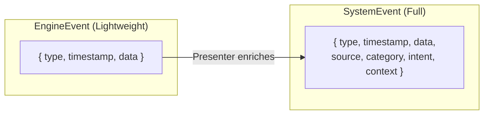
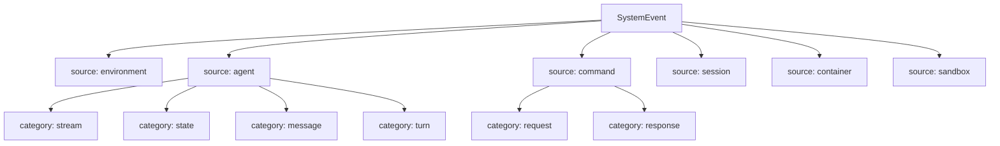
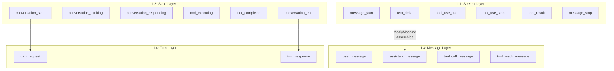
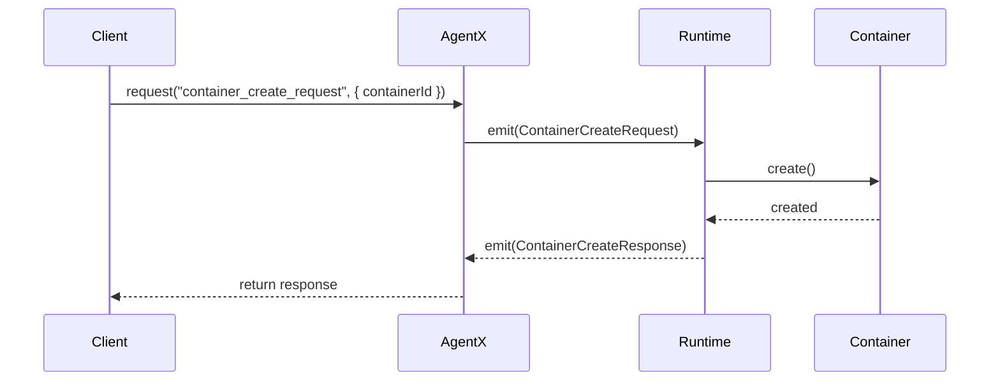
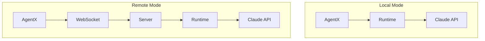
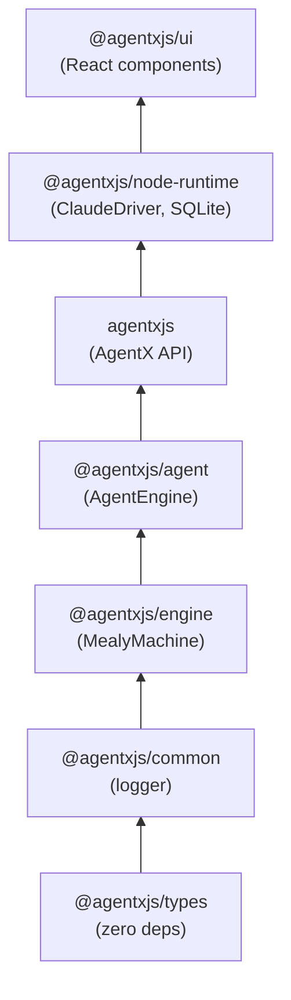

# Architecture Overview

AgentX is an event-driven AI Agent framework built on a clean separation between the **Engine domain** (pure logic) and **Runtime domain** (infrastructure).

## Two-Domain Architecture



### Engine Domain

The Engine domain is **independent and testable without I/O**. It can be tested with mock drivers.

| Component | Responsibility |
|-----------|---------------|
| **AgentDriver** | Message processor: `receive(message) → AsyncIterable<StreamEvent>` |
| **AgentEngine** | Event processing coordinator, state management |
| **MealyMachine** | Pure state machine for event assembly |
| **Presenter** | Event consumer interface (side effects) |

**Key characteristic**: Engine uses **lightweight events** with only `{ type, timestamp, data }`.

### Runtime Domain

The Runtime domain manages the **complete system lifecycle** with persistence, isolation, and event routing.

| Component | Responsibility |
|-----------|---------------|
| **Runtime** | Top-level API, SystemBus owner |
| **SystemBus** | Event routing and subscription |
| **Container** | Isolation boundary, agent registry |
| **Agent** | Complete runtime entity (Engine + Session + Sandbox) |
| **Session** | Conversation history, persistence |
| **Sandbox** | Isolated environment (filesystem, MCP tools) |

**Key characteristic**: Runtime uses **full events** with `{ type, timestamp, data, source, category, intent, context }`.

## Two Event Structures

AgentX has two event structures for different purposes:



| Field | EngineEvent | SystemEvent |
|-------|-------------|-------------|
| type | Event identifier | Event identifier |
| timestamp | When it happened | When it happened |
| data | Event payload | Event payload |
| source | - | Where it came from |
| category | - | Classification |
| intent | - | notification/request/result |
| context | - | Scope (containerId, agentId, sessionId) |

**Why two structures?**
- Engine needs minimal overhead for pure event processing
- Runtime needs rich metadata for routing, filtering, and debugging

## Event Sources and Categories

SystemEvent uses `source` and `category` for classification:



| Source | Categories | Description |
|--------|-----------|-------------|
| `agent` | stream, state, message, turn | Agent internal events (4-layer) |
| `command` | request, response | API operations |
| `environment` | stream, connection | External world (Claude API) |
| `session` | lifecycle, persist, action | Session operations |
| `container` | lifecycle | Container operations |
| `sandbox` | workdir, mcp | Sandbox resources |

## Four-Layer Event System

Agent events follow a 4-layer hierarchy, each serving different consumers:



| Layer | Category | Purpose | Consumers |
|-------|----------|---------|-----------|
| **Stream** | stream | Real-time incremental updates | UI typewriter effect |
| **State** | state | Agent state transitions | Loading indicators, state machines |
| **Message** | message | Complete conversation records | Chat history, persistence |
| **Turn** | turn | Usage metrics and analytics | Billing, monitoring |

## Command Event Pattern

All API operations use request/response events:



Request types and their responses:

| Request | Response | Description |
|---------|----------|-------------|
| `container_create_request` | `container_create_response` | Create container |
| `agent_run_request` | `agent_run_response` | Run agent |
| `agent_receive_request` | `agent_receive_response` | Send message |
| `agent_destroy_request` | `agent_destroy_response` | Destroy agent |
| `image_snapshot_request` | `image_snapshot_response` | Create image |

## AgentX: Local vs Remote

AgentX provides the same API for both local and remote modes:



```typescript
// Local mode - embedded runtime
const agentx = await createAgentX();

// Remote mode - connect to server
const agentx = await createAgentX({ server: "ws://localhost:5200" });

// Same API for both!
await agentx.request("agent_run_request", { containerId, config });
agentx.on("text_delta", (e) => console.log(e.data.text));
```

## Package Dependencies



## Next Steps

- [Event System](./event-system.md) - Deep dive into the four-layer event system
- [Lifecycle](./lifecycle.md) - Agent lifecycle management
- [Mealy Machine](./mealy-machine.md) - The core state machine pattern
